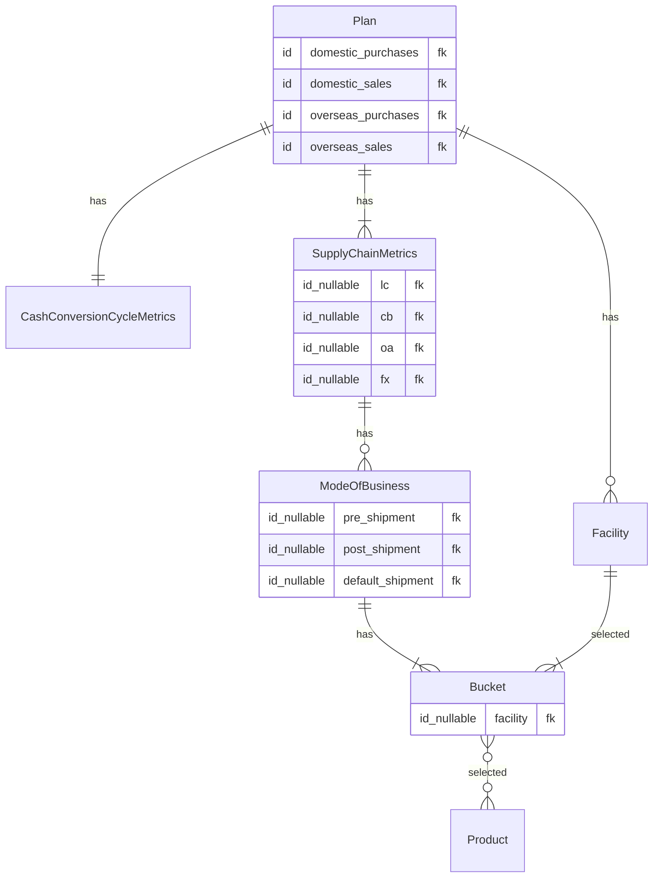

```mermaid
erDiagram
    Plan ||--|| CashConversionCycleMetrics: has
    Plan ||--|{ SupplyChainMetrics : has
    SupplyChainMetrics ||--o{ ModeOfBusiness : has
    ModeOfBusiness ||--|{ Bucket: has
    Plan ||--o{ Facility: has
    Bucket o{--o{ Product: selected
    Facility ||--|{ Bucket: selected

    Plan {
        id domestic_purchases fk
        id domestic_sales fk
        id overseas_purchases fk
        id overseas_sales fk
    }

    SupplyChainMetrics {
        id_nullable lc fk
        id_nullable cb fk
        id_nullable oa fk
        id_nullable fx fk
    }

    ModeOfBusiness {
        id_nullable pre_shipment fk
        id_nullable post_shipment fk
        id_nullable default_shipment fk
    }

    Bucket {
        id_nullable facility fk
    }
```
