# Quiz Taking System

## Specification
1. Managing a quiz through the Library
  - Actor: A librarian
2. Register a new student at the Front Desk
3. A student takes a quiz through the Examination by responding to each question (Question Response)
4. A student reviews the quiz score through the Exam Result scored by the Examiner
5. A student reviews the quiz history through the Exam History
  - Actor: A student
  - Description: A user wants to view their exam history.
  - Interactions: The user accesses the exams history section to view a list of 
exams, including exam details, re-play, quiz results, and correct answers.
6. A student reviews score trends and his statistics through the Exam History

## Class Diagram

```mermaid

---
title: Entities
---

classDiagram
    class Quiz
    Quiz: +name
    Quiz: +date
    Quiz: +section[]
    Quiz: +sectionStrategyType
    Quiz: getSection(id)
    Quiz: getQuestion(sectionId, questionId)

    class Section
    Section: +name
    Section: +sectionQuestions[]
    Section: +prevSectionRequirements[]
    Section: getQuestion(id)

    class sectionQuestion
    sectionQuestion: +question
    sectionQuestion: +scaled_scores float[]

    class questionExaminerService
    questionExaminerService: getRawScore(question, response) -> float

    class Question
    Question: +title
    Question: +body
    Question: +enum questionType [mcq|frq|bsq|rsq]
    Question: +questionExaminer
    Question: getExpectedAnswer() -> str
    Question: getRawScore(response) -> str

    class quizExaminerService
    quizExaminerService: +quiz
    quizExaminerService: calcScaledScore(question, section, response)

    class ExaminationService
    ExaminationService: +quiz
    ExaminationService: +quizExaminer
    ExaminationService: +sectionStrategy
    ExaminationService: start()
    ExaminationService: next_question()
    ExaminationService: add_response(question, response)
    ExaminationService: jump_to_question(id)
    ExaminationService: next_section()
    ExaminationService: pause()
    ExaminationService: resume()
    ExaminationService: quit()
    ExaminationService: end()
    ExaminationService: getResult(section nullable, question nullable)

    class LibraryService
    LibraryService: +create_quiz(quiz, strategy_type)
    LibraryService: +create_section(quiz, section, prev_section_requirements[])
    LibraryService: +add_question(quiz, section, section, scaled_score)
```

